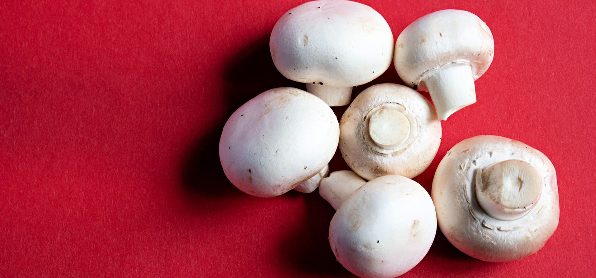

# 1. White Button Mushrooms

### Scientific Name:
Agaricus Bisporus, Champignons, Common mushrooms.

### Description:
These are the most common type of mushrooms that are the youngest of the Agaricus Bisporus variety, which also includes creminis and portobello. White button mushrooms are the most popular type worldwide and are often used in soups, sauces, and sautés but can also be eaten raw in fresh salads. They have a mild flavor and a soft texture.

## Recipes:
- [Herb Garlic Mushrooms](https://www.sidechef.com/de/recipes/19907/herb_garlic_mushrooms/)
- [Pan Seared Flank Steak With Easy Mushroom Sauce](https://www.sidechef.com/de/recipes/106133/pan_seared_flank_steak_with_easy_mushroom_sauce/)
- [One Pot Orzo With Mushrooms And Spinach](https://www.sidechef.com/de/recipes/67625/one_pot_orzo_with_mushrooms_and_spinach/)
- [Apple Gruyere Stuffed Mushrooms](https://www.sidechef.com/de/recipes/5253/apple_gruyere_stuffed_mushrooms/)

## Benefits and uses:
- [White Mushrooms: Nutrition, Benefits, and Uses - Healthline](https://www.healthline.com/nutrition/white-mushroom-nutrition)
- [White Button Mushroom Benefits and Side effects](https://foodthesis.com/white-button-mushroom-health-benefits-and-side-effects/)
- [The Incredible Benefits of White Button Mushrooms You Need to Know](https://mushroomcove.com/mushroom-health-benefits/benefits-of-white-button-mushrooms/)
