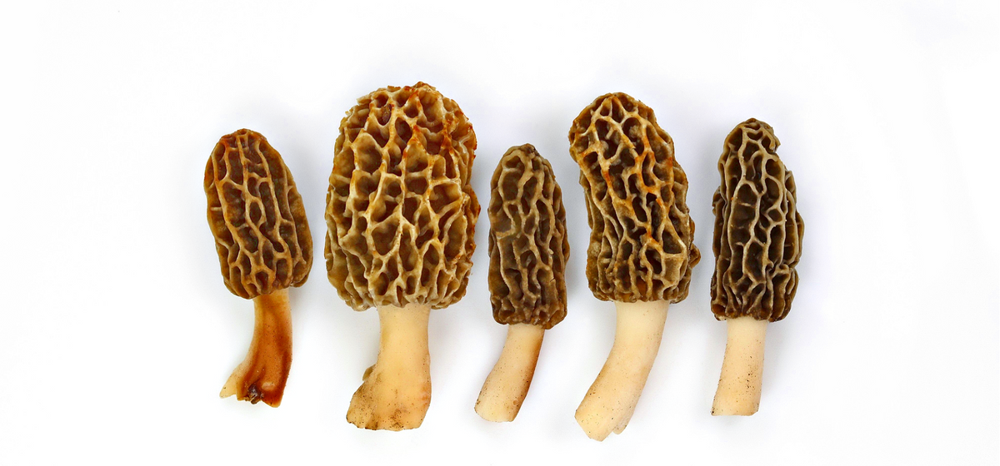

# 10. Morels

### Scientific Name:
Morchella Esculenta, Molly Moocher, Haystack, Dryland Fish Morels are popular in French cuisine and are considered a gourmet mushroom.

### Description:
Morels only grow in the wild, making them one of the most sought-after and desired ingredients among chefs, foodies, and mushroom enthusiasts. Morels have a unique honeycomb-like appearance with a hollow stem. They often grow close to oak, elm, ash, and aspen trees and often appear in disturbed areas after a fire. Morels are pretty controversial. On the one hand, they are praised for their unique flavor, often called one of the finest-tasting mushrooms on Earth. On the other hand, raw morels can be highly toxic and poisonous to humans. You should only eat thoroughly cooked morels and avoid consuming them with any type of alcohol to be on the safe side, as morels contain small amounts of hydrazine toxins, which can cause nausea and irritate the stomach. Their flavor is earthy, nutty, and slightly fruity with a hint of bittersweetness. Morels go well in rich cream sauces, soups, and sautés. If you were lucky to get some morels, try making this exquisite

## Recipes:
- [Farro Risotto With Morel Mushrooms And Asparagus](https://www.sidechef.com/de/recipes/5758/farro_risotto_with_morel_mushrooms_asparagus/)

## Benefits and uses:
- [Morel Mushrooms Benefits, Uses, Recipes, How to Hunt Them - Dr. Axe](https://draxe.com/nutrition/morel-mushrooms/)
- [7 Amazing Health Benefits of Morel Mushrooms - UMM](https://ultimatemedicinalmushrooms.com/health-benefits-of-morel-mushrooms/)
- [10 Evidence-Based Health Benefits Of Morel Mushrooms](https://www.boldsky.com/health/nutrition/10-evidence-based-health-benefits-of-morel-mushrooms-140855.html)
