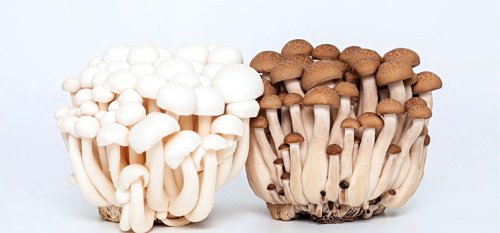

# 11. Beech Mushrooms

### Scientific Name:
Lyophyllum Shimeji, Clamshell Beech mushrooms are native to East Asia and most commonly grow in the wild under beech trees in Japan, where they get their name.

### Description:
Beech mushrooms vary in size, shape, and color - they have long slender stems and small round caps. White Beech is the most popular variety; it has a crunchy texture and a delicately mild flavor, both satisfyingly sweet and nutty when cooked. They can be consumed raw and are not poisonous, but they don't taste pleasant and are quite bitter. Beech mushrooms work well in soups, stews, stir-fries, or sauces and maintain their crisp texture even when cooked. Try this .

## Recipes:
- [Winter Melon And Shimeji Mushroom Soup](https://www.sidechef.com/de/recipes/2882/winter_melon_and_shimeji_mushroom_soup/)

## Benefits and uses:
- [Beech Mushroom uses - Health Benefits Times](https://www.healthbenefitstimes.com/beech-mushroom/)
- [The Nutritional Powerhouse: Are Beech Mushrooms Good for You ... - Foraged](https://www.foraged.com/blog/are-beech-mushrooms-good-for-you)
- [Everything You Wanted To Know About Beech Mushrooms - Gardeners' Magazine](https://gardenersmag.com/beech-mushrooms/)
