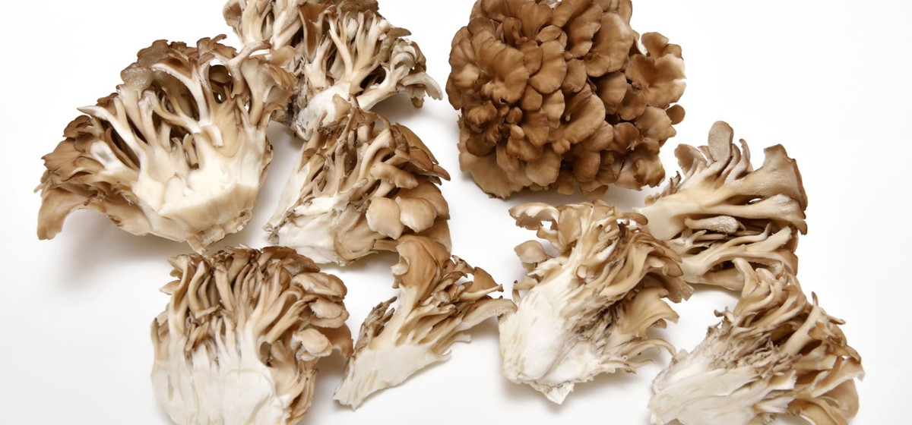

# 12. Maitake

### Scientific Name:
Champignon Dansant, Dancing Mushroom, Grifola, Hen of the Woods, King of Mushrooms, Monkey's Bench Maitake is a cluster-type mushroom popular in Japan.

### Description:
"Maitake" means "dancing" in Japanese, and the mushroom claims to get its name after people danced with happiness if they managed to find it in the wild. It has a distinctive appearance; it looks like a cluster of ruffled fan-shaped caps attached to a thick stem. This mushroom is also known for its health benefits and is widely used in supplements and traditional medicine. Maitake is rich in Vitamin D, known to reduce blood pressure, lower cholesterol, and boost immunity. Maitake's flavor is rich, peppery, and earthy. Try it with this  recipe.

## Recipes:
- [Szechuan Tofu With Sticky Rice And Ponzu Veggies](https://www.sidechef.com/de/recipes/4790/szechuan_tofu_with_sticky_rice_and_ponzu_veggies/)

## Benefits and uses:
- [4 Proven Health Benefits of Maitake Mushrooms - Organic Facts](https://www.organicfacts.net/maitake-mushrooms.html)
- [Maitake Mushroom: Risks, Benefits, and More - Healthline](https://www.healthline.com/health/food-nutrition/maitake-mushroom)
- [Maitake Mushroom: Health Benefits, Nutrition, and Uses - WebMD](https://www.webmd.com/diet/maitake-mushroom-health-benefits)
