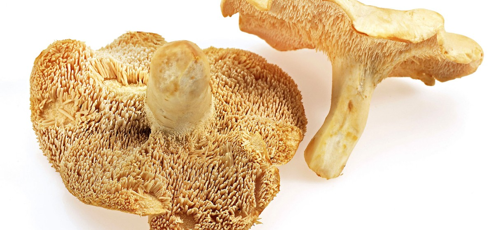

# 13. Hedgehog Mushroom

### Scientific Name:
Hydnum Repandum, Sweet Tooth Hedgehog mushrooms are small gilled mushrooms and look similar to universally praised chanterelles.

### Description:
It gets its name from the spines or "teeth" on the underside of their caps that resemble hedgehog's spines. Hedgehog mushrooms come in different shades  - from white to salmon pink. This mushroom is one of the most delicious fungi in the wild, with a somewhat sweet nutty taste and peppery aftertaste. Hedgehog mushrooms taste best when they are young and fresh. They can be used in any dish where you would use chanterelles - sautés, soups, sauces, and stews. Try using them in this scrumptious

## Recipes:
- [Wild Mushroom Ragout](https://www.sidechef.com/de/recipes/159/wild_mushroom_ragout/)

## Benefits and uses:
- [The Complete Guide to the Hedgehog Mushroom - Shroomer](https://www.shroomer.com/hedgehog-mushroom/)
- [Hedgehog Mushroom (Hydnum repandum): Benefits & Identification](https://healing-mushrooms.net/archives/hydnum-repandum.html)
- [Uncovering the Health Benefits of Hedgehog Mushrooms ... - Foraged](https://www.foraged.com/blog/hedgehog-mushrooms-health-benefits)
