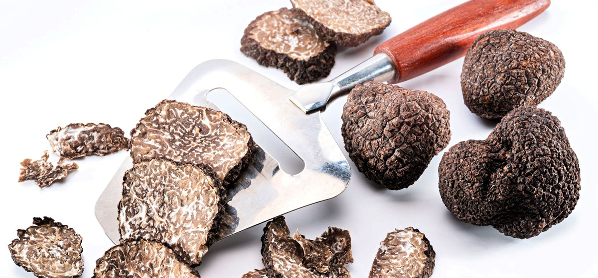

# 14. Truffles

### Scientific Name:
Tuber Melanosporum, Fragrant Diamond', Black Pearl, Shadowy Lady, Underground Empress Truffles don't need much introduction.

### Description:
They are the most exquisite and expensive types of mushrooms in the world. They have a distinctive appearance - they look like small black or white potatoes with irregular shapes. Truffles grow underground near tree roots and are found using truffle pigs or dogs as they can smell them. Truffles are spicy and musky, with their aroma as strong as their taste. They are one of the most potent umami agents -   They are often used as a flavoring or seasoning agent, and only a small amount is needed to impart their flavor to a dish. Truffles can be eaten raw and shaved over any dish you want to add some rich gamey flavor. You shouldn't cook truffles as heat will damage their taste and aroma. Enjoy the flavor of this unique mushroom in  or shave some truffle over this Jumbo Scallops With Wild Mushroom Risotto.

## Recipes:
- [Baked Crispy Truffled Fries](https://www.sidechef.com/de/recipes/2765/oven_baked_crispy_truffled_fries/)

## Benefits and uses:
- [Health Benefits of Truffles - WebMD](https://www.webmd.com/food-recipes/benefits-truffles)
- [8 Amazing Health Benefits of Truffle - Organic Facts](https://www.organicfacts.net/truffle.html)
- [6 Surprising Health Benefits of Truffles](https://www.healthline.com/nutrition/truffles)
