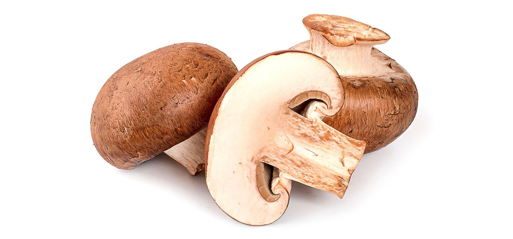

# 2. Cremini

### Scientific Name:
Agaricus Bisporus, Baby Bella, Baby Portabello Creminis are a slightly older sibling of button mushrooms.

### Description:
They belong to the same variety of Agaricus bisporus and are harvested when they are a bit more mature. Cremini mushrooms have brown caps and a firmer texture; they also have a deeper earthy flavor and usually cost more than button mushrooms. Yet, you can replace creminis with white buttons and vice versa in most recipes.

## Recipes:
- [Creamy Mushroom Farfalle](https://www.sidechef.com/de/recipes/36970/creamy_mushroom_farfalle/)
- [Italian Sausage Pesto Pizza With Cremini Mushrooms](https://www.sidechef.com/de/recipes/5341/italian_sausage_pesto_pizza_with_crimini_mushrooms/)
- [Mushroom Rice Bowl](https://www.sidechef.com/de/recipes/3219/mushroom_rice_bowl/)

## Benefits and uses:
- [Health Benefits of Crimini Mushrooms - WebMD](https://www.webmd.com/diet/health-benefits-crimini-mushrooms)
- [What Are Cremini Mushrooms? Benefits, Uses, Recipes - Dr. Axe](https://draxe.com/nutrition/cremini-mushrooms/)
- [Cremini Mushroom Nutrition Facts and Health Benefits - Greatist](https://greatist.com/health/cremini-mushroom-nutrition)
