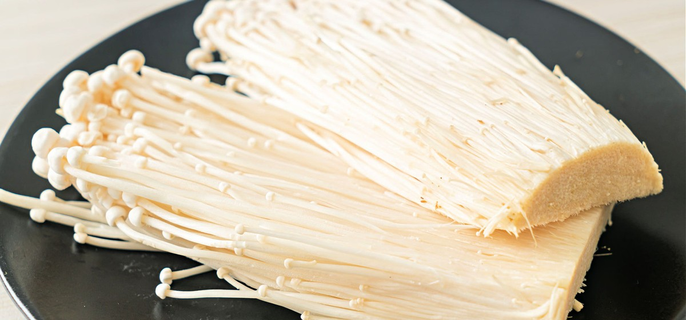

# 6. Enoki

### Scientific Name:
 Flammulina Filiformis, Enokitake, Golden Needle Mushrooms, Lily Mushrooms Enoki mushrooms are also called golden needles for their long thin shape.

### Description:
They are delicate and have a mild flavor with a slightly crunchy texture. They grow in bundles and need to be separated and washed before cooking. Because of their tender, almost fragile surface, it can be tricky to clean them. To clean enoki, you should cut off the root and gently separate them into smaller bundles first; place them in a bowl and run under cold water, then drain and carefully pat dry with a kitchen towel. You can eat them raw or cooked. Enoki mushrooms are very popular in Asian cuisine and are common in soups and salads but can also be stir-fried or grilled.

## Recipes:
- [Kimchi And Tofu Stew Jjigae](https://www.sidechef.com/de/recipes/11672/spicy_kimchi_tofu_stew_kimchi_jjigae/)
- [Enoki Mushroom Stir Fry](https://www.sidechef.com/de/recipes/5099/enoki_mushroom_stir_fry/)

## Benefits and uses:
- [7 Unique Benefits of Enoki Mushrooms - Healthline](https://www.healthline.com/nutrition/enoki-mushrooms-benefits)
- [Enoki Mushrooms: Their Nutritional Value and Health Benefits - WebMD](https://www.webmd.com/diet/health-benefits-of-enoki-mushrooms)
- [Enoki Mushroom Benefits, Nutrition, Recipes and More - Dr. Axe](https://draxe.com/nutrition/enoki-mushroom-benefits/)
